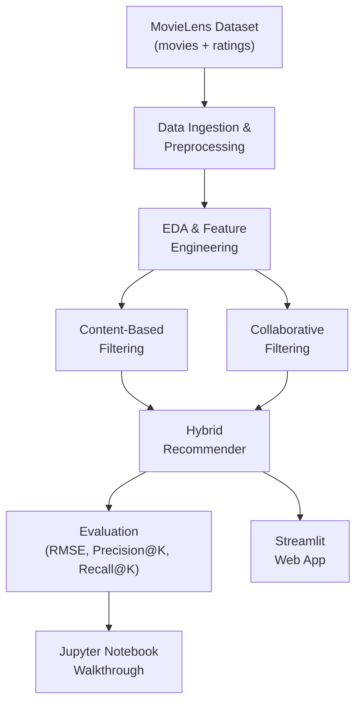

# Hybrid Movie Recommendation System — Portfolio Project

A hybrid movie recommendation system using the **MovieLens dataset** that combines content-based and collaborative filtering approaches. Delivered as both a **Jupyter Notebook** (technical walkthrough) and a **Streamlit web app** (interactive demo). Entirely free — no paid APIs, services, or datasets.

---

## Architecture Overview



### System Components

| Component | Description | Tech Stack |
|-----------|-------------|------------|
| **Data Layer** | MovieLens 100K dataset (100,000 ratings, 9,000 movies) | `pandas`, `numpy` |
| **Content-Based Engine** | TF-IDF on genres + metadata → cosine similarity | `scikit-learn` |
| **Collaborative Filtering** | KNN, SVD, NMF algorithms compared | `surprise` library |
| **Hybrid Engine** | Weighted combination of both approaches | Custom Python |
| **Evaluation** | RMSE, MAE, Precision@K, Recall@K, cross-validation | `surprise`, `scikit-learn` |
| **Notebook** | Full EDA → modeling → evaluation walkthrough | `jupyter`, `matplotlib`, `seaborn` |
| **Web App** | Interactive recommendation demo | `streamlit` |
| **Deployment** | Free hosting for the Streamlit app | Streamlit Community Cloud |

---

## Dataset

**MovieLens Latest Small** (free from [GroupLens](https://grouplens.org/datasets/movielens/)):
- `ratings.csv` — 100,836 ratings from 610 users on 9,742 movies
- `movies.csv` — Movie titles, genres
- `tags.csv` — User-generated tags
- `links.csv` — Links to TMDB/IMDB

> [!NOTE]
> The dataset is downloaded programmatically via URL — no manual download needed. It's freely available for research and educational use.

---

## Proposed Changes

### Project Structure

```
test-field/
├── README.md                        # Project overview, setup, results
├── requirements.txt                 # All Python dependencies
├── data/
│   └── download_data.py             # Script to auto-download MovieLens
├── notebooks/
│   └── recommendation_system.ipynb  # Full walkthrough notebook
├── src/
│   ├── __init__.py
│   ├── data_loader.py               # Data loading & preprocessing
│   ├── content_based.py             # Content-based filtering engine
│   ├── collaborative.py             # Collaborative filtering (KNN, SVD, NMF)
│   ├── hybrid.py                    # Hybrid recommender combining both
│   └── evaluation.py                # Metrics & evaluation utilities
├── app/
│   └── streamlit_app.py             # Streamlit interactive web app
└── models/                          # Saved trained models (gitignored)
    └── .gitkeep
```

---

### Data Layer

#### [NEW] `data/download_data.py`
- Downloads MovieLens Latest Small dataset via `urllib`/`zipfile` (no API key needed)
- Extracts to `data/ml-latest-small/`
- Idempotent — skips if already downloaded

#### [NEW] `src/data_loader.py`
- Loads `ratings.csv`, `movies.csv`, `tags.csv` into DataFrames
- Cleans data: handles missing values, parses genres into lists
- Creates user-item interaction matrix
- Splits data into train/test sets (80/20)

---

### Content-Based Filtering Engine

#### [NEW] `src/content_based.py`

**Algorithm**: TF-IDF Vectorization + Cosine Similarity

```
Workflow:
1. Combine genres + tags into a single text feature per movie
2. Apply TF-IDF vectorization to create feature vectors
3. Compute pairwise cosine similarity matrix
4. For a given movie → return top-N most similar movies
5. For a given user → aggregate similarities from their rated movies
```

**Key methods**:
- `fit(movies_df, tags_df)` — builds the TF-IDF model and similarity matrix
- `recommend_similar(movie_id, n=10)` — item-to-item recommendations
- `recommend_for_user(user_id, ratings_df, n=10)` — user-level recommendations based on their history

---

### Collaborative Filtering Engine

#### [NEW] `src/collaborative.py`

**Algorithms compared** (via `surprise` library):

| Algorithm | Type | Key Idea |
|-----------|------|----------|
| **KNN Basic** | Memory-based | Find similar users/items, predict from neighbors |
| **SVD** | Model-based | Matrix factorization into latent factors |
| **NMF** | Model-based | Non-negative matrix factorization |

**Key methods**:
- `train(algo_name, trainset)` — trains the selected algorithm
- `predict(user_id, movie_id)` — predicts a rating
- `recommend_for_user(user_id, n=10)` — top-N unseen movie recommendations
- `cross_validate(algo_name, dataset)` — 5-fold CV with RMSE/MAE

---

### Hybrid Recommender

#### [NEW] `src/hybrid.py`

**Strategy**: Weighted hybrid

```
hybrid_score = α × content_score + (1 - α) × collaborative_score
```

- Default `α = 0.3` (collaborative filtering usually dominates, but content-based fills cold-start gaps)
- Normalizes scores from both engines to [0, 1] before combining
- Falls back to content-based for new users (cold-start handling)

**Key methods**:
- `fit(ratings_df, movies_df, tags_df)` — trains both engines
- `recommend(user_id, n=10, alpha=0.3)` — hybrid recommendations
- `explain(user_id, movie_id)` — shows why a movie was recommended (content similarity + predicted rating)

---

### Evaluation Module

#### [NEW] `src/evaluation.py`

**Metrics**:
- **RMSE / MAE** — rating prediction accuracy (via `surprise`)
- **Precision@K** — fraction of recommended items that are relevant
- **Recall@K** — fraction of relevant items that are recommended
- **Coverage** — % of items that can be recommended
- **Algorithm comparison table** — side-by-side results for KNN vs SVD vs NMF vs Hybrid

---

### Jupyter Notebook

#### [NEW] `notebooks/recommendation_system.ipynb`

Structured walkthrough with clear sections:

1. **Introduction** — Problem statement, dataset overview
2. **Data Loading & Cleaning** — With inline output previews
3. **EDA** — Rating distributions, genre popularity, user activity, sparsity analysis
4. **Content-Based Model** — Build, explain, visualize similarity
5. **Collaborative Filtering** — Train KNN/SVD/NMF, compare via cross-validation
6. **Hybrid Model** — Combine, show improved results
7. **Evaluation & Comparison** — Tables + charts comparing all approaches
8. **Conclusions** — Key findings, strengths/weaknesses, future work

Visualization library: `matplotlib` + `seaborn`

---

### Streamlit Web App

#### [NEW] `app/streamlit_app.py`

**Features**:
- 🎬 **Movie Search** — Search and select a movie to get similar recommendations
- 👤 **User Profile** — Select an existing user or create a quick profile by rating a few movies
- 🔀 **Algorithm Picker** — Toggle between Content-Based / Collaborative / Hybrid
- 📊 **Why This Recommendation?** — Explainability panel showing scores
- 📈 **Model Comparison Dashboard** — Visual comparison of algorithm performance

**Deployment**: Streamlit Community Cloud (free, connects to GitHub repo)

---

### Configuration & Setup

#### [NEW] `requirements.txt`
```
pandas>=1.5.0
numpy>=1.23.0
scikit-learn>=1.2.0
scikit-surprise>=1.1.3
matplotlib>=3.6.0
seaborn>=0.12.0
jupyter>=1.0.0
streamlit>=1.28.0
```

#### [MODIFY] `README.md`
- Project title, description, and motivation
- Architecture diagram
- Setup instructions (`pip install -r requirements.txt`)
- How to run the notebook and Streamlit app
- Sample results & screenshots
- Deployment link (once deployed)

---

## Open Questions

> [!IMPORTANT]
> **Python version**: Do you have Python 3.8+ installed? The `surprise` library requires it. If not, I can help set up a virtual environment.

> [!IMPORTANT]
> **Streamlit deployment**: Do you have a GitHub account to deploy on Streamlit Community Cloud? (It's free, just needs GitHub OAuth.) Or would you prefer to keep it local-only for now?

---

## Verification Plan

### Automated Tests
- Run the data download script and verify dataset loads correctly
- Run cross-validation on all algorithms and verify RMSE < 1.0 (sanity check)
- Run the Streamlit app locally (`streamlit run app/streamlit_app.py`) and verify all interactive features work

### Manual Verification
- Walk through the Jupyter Notebook end-to-end, verifying all cells execute without errors
- Verify the recommendation quality by spot-checking outputs for known movies
- Ensure the Streamlit app renders correctly and all interactive elements respond

---

## Cost Breakdown

| Component | Cost |
|-----------|------|
| MovieLens Dataset | Free (research/educational use) |
| Python + all libraries | Free (open-source) |
| Jupyter Notebook | Free |
| Streamlit | Free |
| Streamlit Community Cloud hosting | Free |
| **Total** | **$0** |
